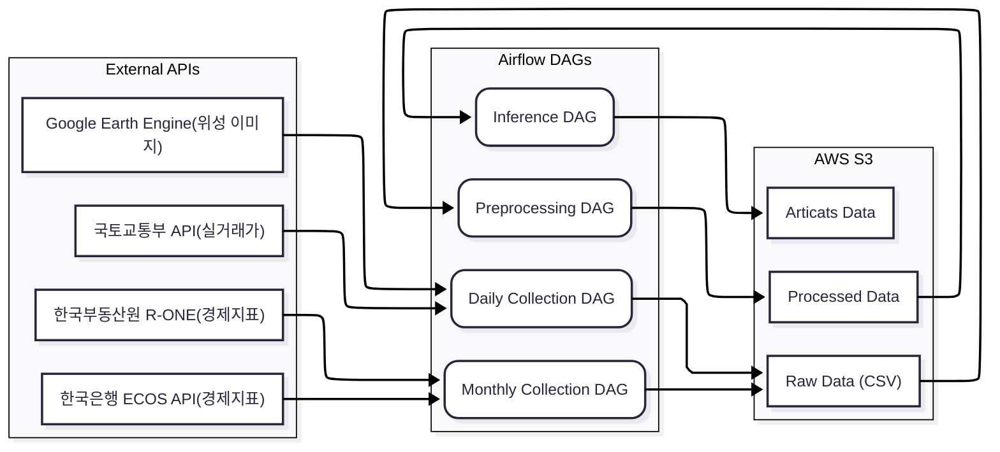

# Airflow 기반 아파트 가격 예측 데이터 파이프라인
**(Automated Apartment Price Prediction Pipeline with Airflow)**

본 프로젝트는 [멀티 모달 데이터를 이용한 TCN 기반 시나리오별 아파트 가격 예측 연구]논문의 모델을 지속적으로 운영하기 위해 구축한 **End-to-End** 데이터 파이프라인입니다.  
매일/매월 갱신되는 부동산 및 경제 데이터를 수집하고, 전처리 및 모델 추론 과정을 Apache Airflow로 자동화하였습니다.

## 프로젝트 개요
|항목|내용|
|---|---|
|진행기간| 2025.07 ~ 2025.10 (약 3개월)|
|참여 인원| 개인 프로젝트(1인)|
|주요 역할| Airflow DAG설계 및 구현, 데이터 수집/전처리 자동화, Docker 환경 구축|
|핵심 기술| `Apache Airflow`, `Docker`, `AWS S3`|

## ❓ 도입 배경
선행 연구를 통해 구축한 아파트 가격 예측 모델은 최신 데이터의 반영이 필수적입니다. 그러나 수동 운영 방식은 다음과 같은 한계가 있었습니다.

1. **데이터 최신성 저하**: 매일 갱신되는 실거래가와 월별 경제지표를 즉시 반영하기 어려움.
2. **비효율적인 반복 작업**: 데이터 전처리, 파생변수 생성, 모델 입력 변환 등 동일한 작업의 수동 반복.
3. **운영 안정성 부족**: 수동 실행 시 휴먼 에러 발생 가능성 및 에러 추적의 어려움.
👉 따라서, 데이터 수집부터 모델 추론까지 전 과정을 자동화하는 Airflow 파이프라인을 구축했습니다.

## 🏗️ 시스템 아키텍처
데이터 흐름과 Airflow DAG의 구조는 다음과 같습니다.

